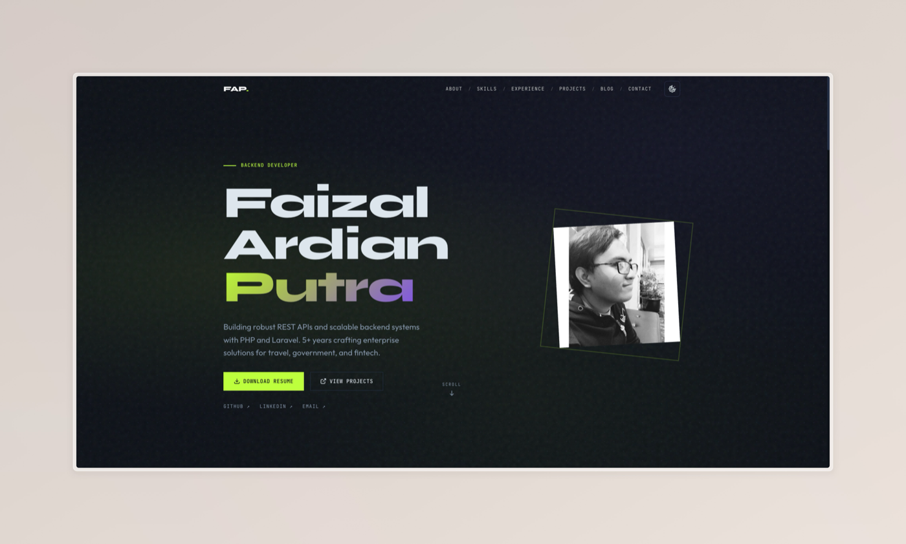

# Faizal Ardian Putra - Portfolio

[](https://github.com/faizal97/faizal97.github.io/actions/workflows/ci.yml)
[](https://astro.build/)
[](https://tailwindcss.com/)
[](https://www.typescriptlang.org/)

Personal portfolio website built with Astro, Tailwind CSS v4, and MDX content collections. Fully static output — deploys to Cloudflare Pages via Wrangler.

**Live Site**: [https://personal-site.fayz.workers.dev](https://personal-site.fayz.workers.dev)



## Tech Stack

| Category | Tools |
|----------|-------|
| Framework | [Astro 5.x](https://astro.build/) — static site generator |
| Styling | [Tailwind CSS v4](https://tailwindcss.com/) via `@tailwindcss/vite` |
| Content | MDX with Astro Content Layer API (glob loader) |
| Typography | Syne (display), Outfit (body), JetBrains Mono (code) |
| Syntax Highlighting | Shiki (github-light / github-dark) |
| Linting & Formatting | [Biome](https://biomejs.dev/) |
| Deployment | [Cloudflare Pages](https://pages.cloudflare.com/) (Wrangler) |
| CI | GitHub Actions — Biome, type check, build, Lychee link check, Lighthouse |
| Package Manager | pnpm |

## Quick Start

```bash
# Clone the repository
git clone https://github.com/faizal97/faizal97.github.io.git
cd faizal97.github.io

# Install dependencies
pnpm install

# Start development server
pnpm dev
```

Open [http://localhost:4321](http://localhost:4321) to view the site.

## Commands

```bash
pnpm dev            # Start dev server (localhost:4321)
pnpm build          # Build static site to dist/
pnpm preview        # Preview production build locally

pnpm lint           # Check with Biome
pnpm lint:fix       # Auto-fix lint issues
pnpm format:check   # Check formatting
pnpm format         # Auto-format code
```

## Project Structure

```
src/
├── pages/
│   ├── index.astro              # Homepage (all sections)
│   ├── 404.astro                # 404 page
│   ├── rss.xml.ts               # RSS feed endpoint
│   ├── blog/
│   │   ├── index.astro          # Blog listing
│   │   └── [...slug].astro      # Individual blog posts
│   └── projects/
│       └── index.astro          # Projects + GitHub repos
├── layouts/
│   └── BaseLayout.astro         # HTML shell, meta, View Transitions
├── components/
│   ├── Navigation.astro         # Fixed nav with mobile menu
│   ├── Footer.astro             # Copyright + social links
│   ├── ThemeToggle.astro        # Dark/light toggle
│   ├── StructuredData.astro     # JSON-LD schemas
│   └── sections/                # Homepage section components
├── content/
│   ├── blog/                    # MDX blog posts
│   └── projects/                # MDX project descriptions
├── lib/
│   └── github.ts                # Build-time GitHub API fetch
├── styles/
│   └── global.css               # Tailwind v4 theme + utilities
└── content.config.ts            # Collection schemas (blog, projects)
```

## Design System

**Theme:** "Midnight Brutalist Editorial"

- Accent: `#c8ff00` (chartreuse)
- Dark background: `#0a0f1a` / Light background: `#faf8f5`
- Dark mode default, toggle persists in localStorage
- CSS custom properties for theming (`--bg`, `--surface`, `--text`, `--muted`, `--border`)

## Content

### Blog Posts (`src/content/blog/*.mdx`)

Frontmatter: `title`, `description`, `pubDate`, `tags`, `draft`

### Projects (`src/content/projects/*.mdx`)

Frontmatter: `title`, `description`, `technologies`, `liveUrl`, `status`, `role`, `scale`, `featured`, `order`

## CI Pipeline

The CI workflow (`.github/workflows/ci.yml`) runs on push/PR to `main`:

1. **Lint & Format** — Biome checks
2. **Build** — TypeScript type checking (`astro check`) + static build
3. **Link Check** — Lychee validates external links in the built output
4. **Lighthouse** — Performance, accessibility, best practices, and SEO audits (min score: 90)

## Deployment

The site is configured for Cloudflare Pages via `wrangler.jsonc`:

```bash
# Deploy manually (requires wrangler auth)
npx wrangler pages deploy dist/
```

The `dist/` directory is a fully static output suitable for any static hosting provider.

## License

This project is open source and available under the [MIT License](LICENSE).

## Contact

**Faizal Ardian Putra** — API Architect & Travel Tech Specialist

- Website: [personal-site.fayz.workers.dev](https://personal-site.fayz.workers.dev)
- LinkedIn: [linkedin.com/in/faizal-ardian-putra](https://linkedin.com/in/faizal-ardian-putra)
- GitHub: [@faizal97](https://github.com/faizal97)
